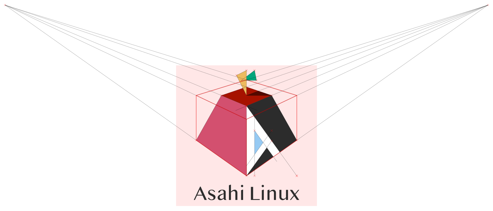

## Asahi Linux logos

This directory contains the logo art for Asahi Linux.

You may use the logos to reference the Asahi Linux project. Please do not use them to represent other projects, or to imply any association with or endorsement by Asahi Linux.

The Asahi Linux logo art is copyright (c) 2021 soundflora* and Hector Martin.

The logo art is licensed under CC BY-SA 4.0. Please see the LICENSE file for the license text.

* Logo design by [soundflora*](https://soundflora.tokyo)
* Editing by [Hector Martin "marcan"](https://github.com/marcan/)
* Font: Bangla MN (c) 2009 [Muthu Nedumaran](http://muthunedumaran.com/) - Used with permission
* Created using [Inkscape](https://inkscape.org)

## Logo variants

These images link to the clean SVG versions of the logos. Additional PNG versions in various sizes are available, please see the file tree. The files under [src](src/) are the original Inkscape data.

### Logo (color)

### Logo (color, for dark backgrounds)

### Logo (monochrome)

### Logomark only (color)

### Logomark (monochrome)

## Logo construction

A geometric reference for how the logo was constructed is available:

Please do not use the SVG data in this file as-is, as the polygons butt up against each other and most SVG renderers do not implement correct anti-aliasing and will produce incorrect output. Use the above SVG versions instead, where the polygons have been overlapped to ensure correct rendering.

